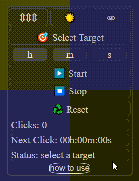

# Safe Auto Clicker — Smart Mouse Click Automation for Any Website

---

# Chrome Web Store

## Safe Auto Clicker — Smart Mouse Click Automation for Any Website

Chrome Web Store:  
https://chromewebstore.google.com/detail/mgadnfjigmdiljhffhjlopjfibddkneh

500+ active users per week

---

# Video Overview

Project overview and architecture explanation video:  
https://youtu.be/rK2RbL6nOBo

Language: Ukrainian

The video includes:

- real use case demonstration on Salesforce CRM
- React + TypeScript architecture overview
- Redux Toolkit flow
- custom hooks explanation
- timer engine logic
- drag & drop implementation
- Fetch API integration
- testing examples
- accessibility considerations

---

# Overview

Safe Auto Clicker is a Chrome extension built with React and TypeScript that automates mouse clicks on any website.

The extension is designed for repetitive UI actions:

- CRM systems
- refresh buttons
- internal dashboards
- repetitive browser interactions
- workflow automation

The user can select any element on a webpage and automatically trigger clicks using a custom timer interval.

---

# Main Features

- Select any DOM element on a website
- Automated clicking with configurable delay
- Start / Stop / Reset controls
- Draggable extension panel
- Light / Dark theme
- Accessibility improvements (a11y)
- Persistent UI state
- Countdown until next click
- Click counter
- Fetch API integration
- Dev mode for fast local development
- Tested business logic with Jest

---

# Tech Stack

## Frontend

- React 19
- TypeScript
- SCSS
- Vite

## State Management

- Redux Toolkit
- React Redux

## Routing

- React Router

## Testing

- Jest

---

# Project Purpose

The extension solves a simple but real problem:

Many CRM systems and dashboards require repetitive user actions such as:

- refreshing pages
- updating tasks
- confirming actions
- clicking UI buttons repeatedly

The extension allows the user to automate these actions directly in the browser.

Example shown in the project video:

- a task was created inside Salesforce CRM
- the extension automatically clicked the refresh button
- the task appeared without manual interaction

---

# Architecture

The project uses:

- reusable UI components
- custom React hooks
- Redux Toolkit slices
- isolated business logic
- TypeScript typing across the entire project

The codebase is separated into:

- UI
- hooks
- logic
- state management
- storage utilities

---

# CSS Isolation Strategy

The extension uses custom prefixed class names and ids such as:

```txt
acext-dark-ss
```

Naming explanation:

- `acext` → Auto Clicker Extension
- `ss` → Security Selector

Purpose:

- prevent website styles from overriding extension UI styles
- isolate extension styling from external pages
- keep consistent appearance across different websites
- reduce CSS conflicts inside complex web applications

This is especially important because the extension works directly inside third-party websites and CRM systems with large existing style systems.

---

# Core Features

## 1. Target Selection System

The user clicks:

```txt
🎯 Select Target
```

After that:

- the extension waits for a click on the webpage
- the clicked DOM element is stored inside Redux state
- this element becomes the target for automation

Main files:

```txt
useSaveElement
handleElementClick
```

The project intentionally stores the actual DOM element inside Redux state.

This approach was chosen because many modern websites dynamically change selectors and DOM structures, making selector-based targeting unreliable in some real-world cases.

The project also explores selector-based approaches and explains their limitations in the video overview.

---

## 2. Auto Click Engine

Main logic:

```txt
useTimerLogic
```

Flow:

- User clicks Start
- Validation runs
- Timer loop starts
- Stored element receives `.click()`
- Process repeats recursively

The project uses `setTimeout` recursion instead of `setInterval`.

Why:

- avoids overlapping executions
- easier cleanup
- more predictable timer flow
- safer for repeated side effects

Example structure:

```ts
setTimeout(() => {
  selectedElement.click();
  tick();
}, delay);
```

---

## 3. Input Validation

Validation is implemented with:

```txt
useInputValidation
```

The project validates:

- hours
- minutes
- seconds

Input fields accept only numeric values using RegExp validation.

Example:

```ts
/^\d*$/
```

Purpose:

- prevent invalid characters
- keep controlled inputs stable
- allow empty string input during editing

---

## 4. Countdown System

The extension includes:

- countdown until next click
- live timer updates
- formatted time display

Main hook:

```txt
useTimeUntilNextClick
```

Features:

- interval cleanup
- time normalization
- dynamic UI updates

---

## 5. Controls

### Start

- validates selected target
- validates timer input
- starts click automation

### Stop

- stops timer execution
- clears active timeout
- preserves selected element and user data

### Reset

- resets Redux state to initial values
- clears timer state
- resets UI status

---

# UI Features

## Drag & Drop Panel

Implemented with:

```txt
useDrag
```

Features:

- draggable extension window
- viewport boundary calculations
- saved panel position

---

## Theme Switching

Features:

- Light theme
- Dark theme
- dynamic UI styles
- accessibility-aware focus colors

---

## Hide / Show System

The panel can be hidden without removing application state.

Uses conditional rendering:

```tsx
{isVisible && <Component />}
```

---

# Accessibility (A11y)

The project includes accessibility improvements:

- keyboard navigation
- focus handling
- ARIA labels
- accessible buttons
- theme-aware focus visibility

## Accessibility Demo



---

# Redux Toolkit Structure

## logicSlice

Handles:

- selected element
- timer state
- click counter
- countdown
- delay state
- drag state

---

## uiSlice

Handles:

- theme
- visibility
- status messages

---

# Fetch API Integration

The project includes a small API integration example.

Used for:

- loading "How to Use" information dynamically
- external JSON data rendering

Data is fetched from a GitHub-hosted JSON file.

---

# Testing

Jest is used for testing business logic.

Examples:

- timer calculations
- validation logic
- delay conversion
- element handling logic

---

# Dev Mode

The project includes a dedicated development mode.

Purpose:

- faster local testing
- development without Chrome extension environment
- isolated UI testing

---

# Project Highlights

This project demonstrates:

- React architecture
- TypeScript usage in real business logic
- Redux Toolkit state management
- custom hooks architecture
- DOM interaction
- timer systems
- accessibility support
- reusable component patterns
- side effect management
- clean code practices

---

## Local Development

```bash
# Clone repository
git clone https://github.com/iKuzenkov/extension-auto-clicker-react-ts.git

# Open project folder
cd extension-auto-clicker-react-ts

# Install dependencies
npm install

# Start development mode
npm run dev
```

### Important

If the Chrome extension version is already enabled in the browser,
disable the installed extension before running dev mode.

Both versions use the same application entry and can conflict with each other during development.

---

# Scripts

```bash
npm run dev
npm run build
npm run lint
npm run lint:fix
npm run preview
npm run format
npm run lint:css
npm run lint:css:fix
npm run test
npm run type-check
npm run done
```

---

# Summary

Safe Auto Clicker is a real-world automation extension focused on:

- practical browser automation
- reusable React architecture
- clean separation of UI and logic
- maintainable TypeScript code
- business-oriented functionality

The project was built not only as a technical exercise, but also as a practical productivity tool inspired by real CRM workflow experience.